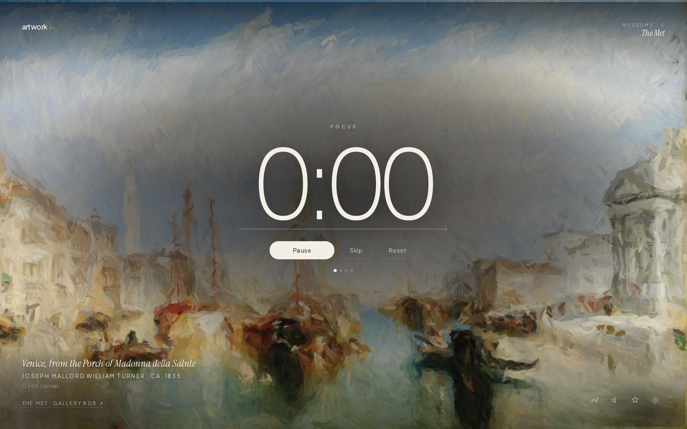
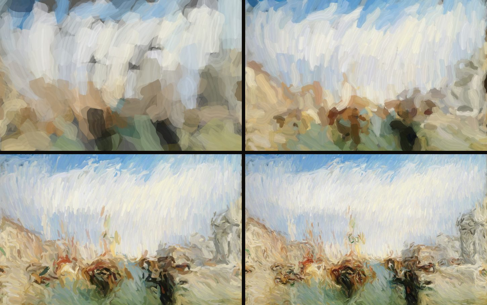
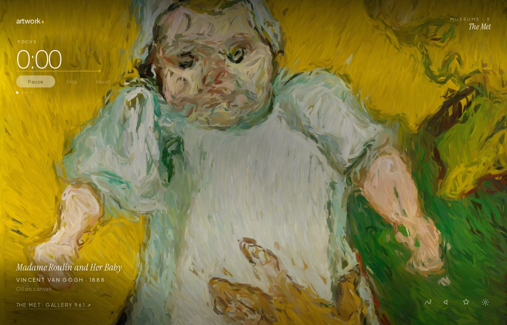
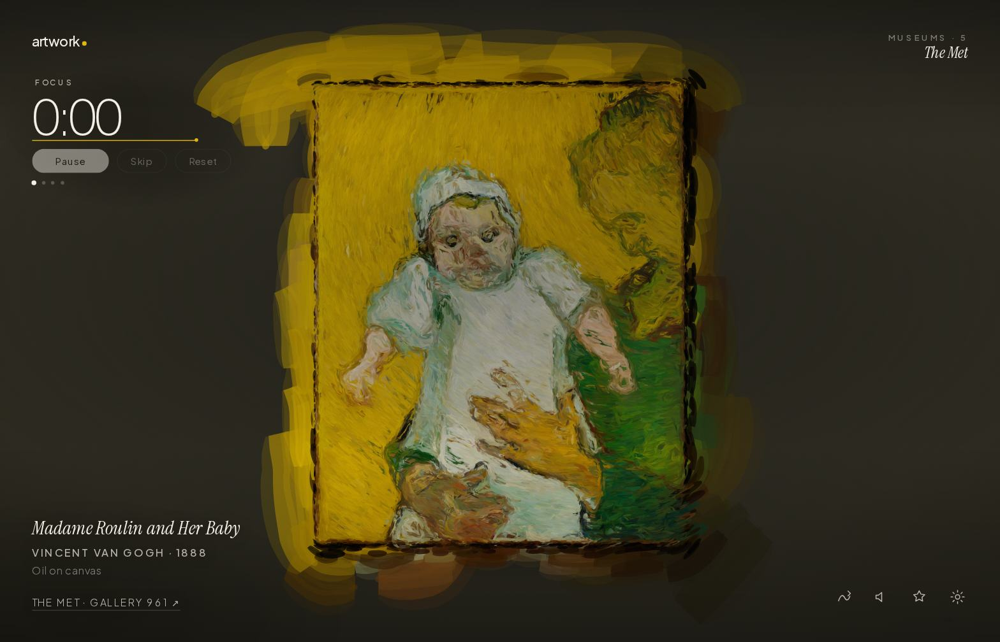
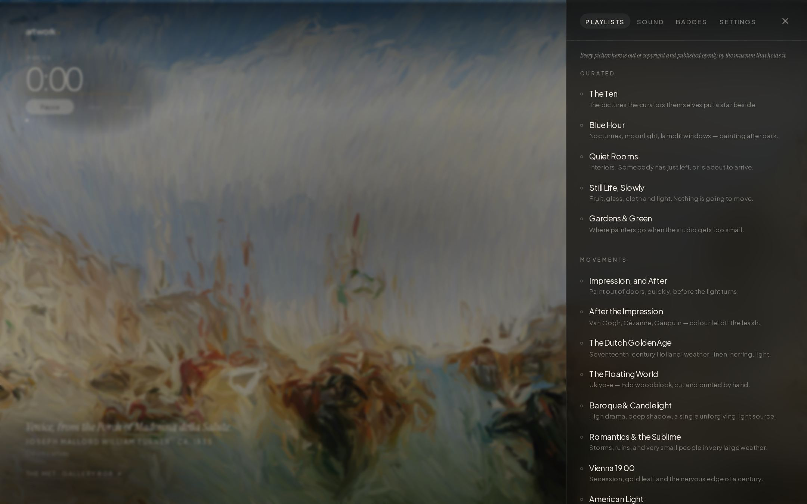
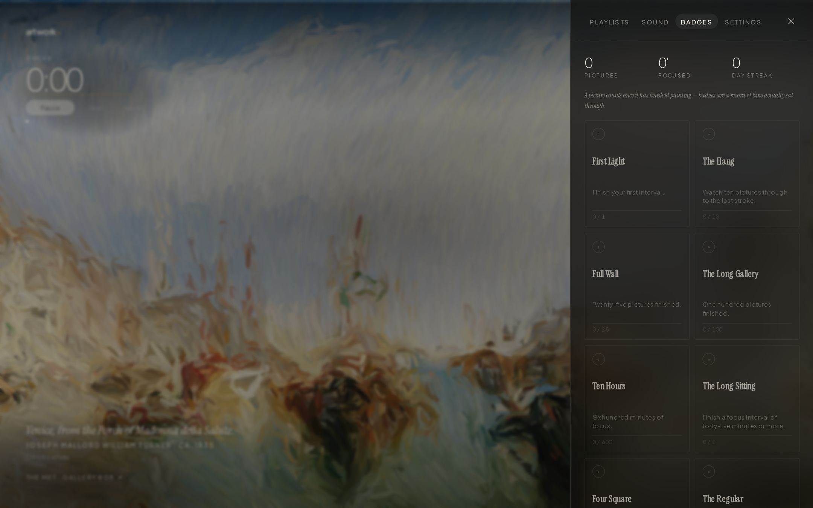

<div align="center">

# artwork

**A pomodoro timer whose background is a museum painting — and the painting paints itself, stroke by stroke, for exactly as long as you work.**

[](LICENSE)
[](#run-it)

[](#notes)



</div>

Twenty-five minutes of focus is twenty-five minutes of brushwork. It starts on a bare toned canvas — the picture is never underneath, waiting to be uncovered. Every mark is a brush stroke that you watch being made: it travels along its path in real time, curving with the local image gradient the way a loaded brush does, tapering at both ends, dragging a few bristles of slightly different paint behind it. Six passes, broad blunt bands down to fine points on the edges, and the last of them lands exactly as the clock reaches zero. Around fourteen thousand strokes, one at a time. The three finishing passes don't scatter: they travel over the picture in bands, so the last stretch is a brush sweeping across and sharpening as it goes, rather than detail appearing everywhere at once.



<sup>One interval, four moments: 6% · 30% · 62% · done. J. M. W. Turner, *Venice, from the Porch of Madonna della Salute*, ca. 1835 — The Met, gallery 808.</sup>

## Run it

Static files, no bundler, no dependencies. It just needs to be served over HTTP, because ES modules are.

```bash
git clone https://github.com/2008wbbv/artwork
cd artwork
python3 -m http.server 8000    # or: npx http-server
```

Then open `http://localhost:8000`. To publish, drop it on any static host — the included Actions workflow deploys to GitHub Pages once *Settings → Pages* is set to **GitHub Actions**.

## What's in it

- **38 playlists** by movement, artist, place, museum and curator's pick — Impressionism, the Dutch Golden Age, Ukiyo-e, Vienna 1900, Monet, Hokusai, Vermeer, Venice, Paris, The Sea, The North, and the Rijksmuseum, Prado, Louvre and National Gallery by way of Wikidata.
- **A wall label** for every picture: title, hand, date, medium, the museum's own note, and the gallery it's hanging in right now. Hover it for the credit line.
- **A museum of your own.** Every picture you sit through is hung on a wall you can walk along, in rooms by century with a *Lately* wall and one for the hands you keep coming back to. It's hung like a real gallery, salon-style: twelve frames — gilt, ornate, swept rococo, Florentine cassetta, oak, walnut, ebony, tortoiseshell, silver leaf, plaster, limewash and a modern shadow box — chosen the way a framer would, by what the picture is and roughly when it was made, then varied within that by the picture's own key so a work always comes back in the same frame. Mounts on works on paper and none on oils. Pictures stack two and three high and crowd into the same horizontal run, columns leaning into their neighbours — but the wall is measured after it's laid out and nothing is ever allowed closer than a hand's breadth to the frame beside it. A light pool over each one, a hairline between rooms, and a bench in the middle if you want to sit. Nothing is stored but the seed — each frame is *repainted* from forty bytes, stroke for stroke, exactly as you first watched it go down. Hover for the label and when you painted it; click to hang it again.
- **One line about what you're doing.** Type it before you start and it sits under the clock, then goes into the record — so the museum reads *Bruegel, 25 minutes, "finishing the deck"* rather than just a date.
- **The hand behind it.** Click the artist and you get a short life off Wikipedia — with their portrait, often a self-portrait, in a gilt frame — and everything else of theirs across the collections. Click any of those and it goes up on the wall.
- **Radio**, from SomaFM and the Radio Browser index — including the stations that play nothing but game soundtracks and chiptune — with what's playing right now. Ducks under the chime between intervals.
- **Or bring your own.** Paste a stream address and it's remembered; or pick audio files off your own machine and they play through as a stack of records, with `[` and `]` to move between them. Files are never uploaded anywhere — the browser hands out a URL that dies with the tab, which is also why they have to be picked again next session.
- **Or use Spotify or Apple Music.** Paste a playlist, album or track and their own player sits in the corner, on the same fade as everything else. Both publish an embed that needs no key, no account and no backend, which is the only kind of thing that can go in a site like this. The trade: it's their page in a frame, so the volume slider here doesn't reach it and it won't duck under the chime — those become its controls — and you get previews rather than whole tracks unless you're already signed in to that service in this browser. Opening one switches the radio off, because two things playing at once helps nobody.
- **A YouTube video, two ways** *(an experiment)*. **Watch** puts one behind the clock instead of a painting, muted, running at whatever speed makes it end exactly when your interval does — a two-hour timelapse over twenty-five minutes of you. YouTube's player only offers rates up to 2×, nowhere near enough, so the rate does the fine work and the playhead is walked forward to keep the video on the same clock as the timer. **Listen** does the opposite: keeps the player out of sight and plays the sound, at its own pace, as your music.
- **23 badges**, awarded only for pictures you actually sat through — ten German painters, twenty Venices, five works by one hand, seven days running.
- **Two ways to look.** *Fill* bleeds the picture off every edge; *Hang* fits the whole thing on a lit wall, which portrait paintings prefer.

   

  <sup>Van Gogh's *Madame Roulin and Her Baby*, filling the screen and hung on the wall.</sup>

- **An interface that gets out of the way.** The clock sits in the middle of the screen until you start; then it steps aside into the corner and leaves the wall to the picture. Hold still for six seconds and everything except the clock fades to nothing — move the mouse and it comes back. The brightness under each cluster of type is measured live, and only that patch of picture is darkened, so the text never fights the painting.

 

## Pictures

Seven open sources. No keys, no accounts, no proxy — every request goes straight from your browser to the collection, and all of them send permissive CORS headers.

| Collection | Endpoint | Filter |
|---|---|---|
| [Art Institute of Chicago](https://api.artic.edu/docs/) | `api.artic.edu` | public domain only |
| [The Metropolitan Museum of Art](https://metmuseum.github.io/) | `collectionapi.metmuseum.org` | `isPublicDomain` only |
| [Cleveland Museum of Art](https://openaccess-api.clevelandart.org/) | `openaccess-api.clevelandart.org` | CC0 only |
| [Victoria and Albert Museum](https://developers.vam.ac.uk/) | `api.vam.ac.uk` | made before 1920 |
| [SMK — National Gallery of Denmark](https://www.smk.dk/en/article/smk-api/) | `api.smk.dk` | `public_domain` only |
| [Wikidata · the sum of all paintings](https://www.wikidata.org/wiki/Wikidata:WikiProject_sum_of_all_paintings) | `query.wikidata.org` + Wikimedia Commons | painted before 1900 |
| [Wikimedia Commons](https://commons.wikimedia.org/wiki/Commons:API) | `commons.wikimedia.org` | freely licensed, credited to the painter |

Wikidata is what reaches the houses that have no API of their own — the Rijksmuseum, the Prado, the Louvre, the National Gallery, the Uffizi, the Hermitage, the Mauritshuis.

Commons is the only one of the seven that holds anything made this century, because it's the only one where a living painter can put their own work up. That's what it's here for: it reaches artists still working, which no museum API does.

Where a work is under a Creative Commons licence rather than in the public domain, the licence wants attribution — so the licence and a link to the file page go on the label beside the picture rather than in a credits file somewhere.

A seventh, **Harvard Art Museums**, is wired up but dormant: it wants a free read-only key. Put one in `js/keys.js` and its shelf appears in the drawer by itself. Nothing else in the app refers to it while that field is empty.

Artist lives and portraits come from the [Wikipedia REST API](https://en.wikipedia.org/api/rest_v1/).

Responses are cached for the best part of a day. Pictures start from the museum's web-sized file and quietly upgrade to the press-quality one mid-interval when the connection looks willing — never on a metered or slow one.

## Keys

| | |
|---|---|
| <kbd>space</kbd> | start · pause |
| <kbd>s</kbd> <kbd>r</kbd> | skip the interval · reset it |
| <kbd>+</kbd> <kbd>−</kbd> | five minutes more or less — the brush keeps pace |
| <kbd>n</kbd> | another painting |
| <kbd>m</kbd> | radio on · off |
| <kbd>g</kbd> | your museum |
| <kbd>p</kbd> <kbd>b</kbd> <kbd>,</kbd> | playlists · badges · settings |

## Notes

- Nothing leaves the browser. Settings, badges, statistics and the museum live in `localStorage` under `artwork.v1.*`; *Settings → Forget everything* clears the lot.
- It installs. There's a manifest and a service worker, so it can be added to a dock or a home screen and opened with no network — the shell is cached, along with the last forty pictures you were shown.
- A desktop note when an interval ends, if you switch it on in Settings. Only fires when you've tabbed away; if you're looking at it, the chime is enough.
- The stroke plan is seeded and deterministic, so resizing the window — or swapping the picture mid-interval — replays instantly to exactly the same level of completion.
- Dead image links happen — collections move files. The queue tries sixteen, remembers the ones that failed so it never asks twice, and if it still comes up empty it repaints the picture already on the wall rather than taking it down. The quiet abstraction is only for a genuine outage, and the shelf refetches itself in the background.
- `prefers-reduced-motion` drops the finest stroke pass and the dissolve between pictures.

```
js/painter.js      the stroke engine
js/gallery.js      viewing order, image loading, caching
js/sources.js      seven collection adapters, normalised to one shape
js/tape.js         the build-timelapse experiment, kept on the timer's clock
js/artist.js       who painted it, and what else of theirs is hanging
js/museum.js       what you've painted, and how it's hung
js/notify.js       the desktop note, off unless asked for
js/keys.js         optional API keys; empty by default
sw.js              the offline shell
js/playlists.js    the catalogue
js/timer.js        wall-clock pomodoro state machine
js/radio.js        stations, streaming, now-playing
js/badges.js       the ledger
js/ui.js           panels, labels, toasts, keys
```

## Credits

- The museums above, for putting their collections in the public domain and then publishing an API for them.
- [Wikidata and Wikimedia Commons](https://www.wikidata.org/wiki/Wikidata:WikiProject_sum_of_all_paintings), for everywhere else, and [Wikipedia](https://en.wikipedia.org) for the lives.
- [SomaFM](https://somafm.com) — listener-supported, advert-free, hand-programmed. If you leave it on all day, [chip in](https://somafm.com/support/).
- [Radio Browser](https://www.radio-browser.info/), a community index of everything else.
- Type is [Plus Jakarta Sans](https://fonts.google.com/specimen/Plus+Jakarta+Sans) and [Instrument Serif](https://fonts.google.com/specimen/Instrument+Serif). The WeWork wordmark is Apercu, which is licensed and can't ship here — Plus Jakarta is the closest free relative. If you own Apercu, put it first in `--sans` at the top of `css/app.css` and everything follows.

## License

MIT. The code is yours to do as you like with. The paintings were already everyone's.
